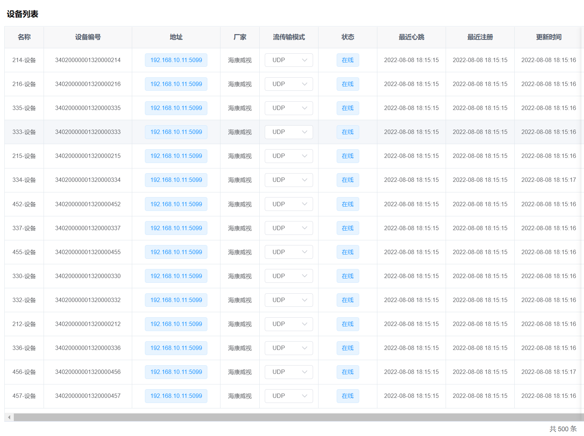
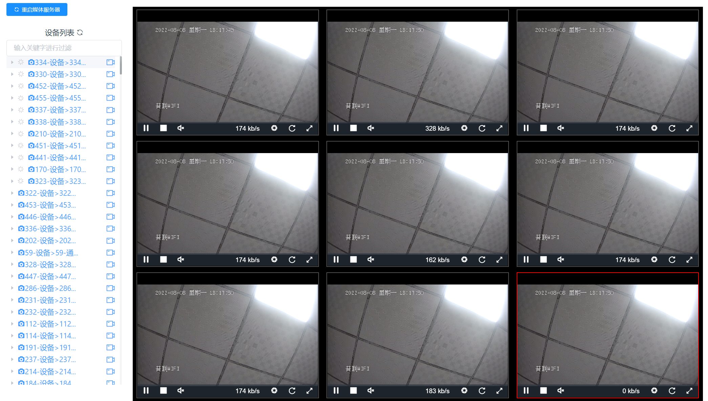

# 国标批量注册拉流测试


本项目根据  [gb28181协议客户端模拟java实现版本](https://github.com/apachefarmer/gb28181-client)[wvp-GB28181-pro ](https://github.com/648540858/wvp-GB28181-pro) 改编, 并借鉴  [wvp-GB28181-pro](https://github.com/648540858/wvp-GB28181-pro)  代码, 

模拟的设备推流更改为使用 [GitHub - ZLMediaKit](https://github.com/ZLMediaKit/ZLMediaKit) 

修复了 [gb28181协议客户端模拟java实现版本](https://github.com/apachefarmer/gb28181-client)[wvp-GB28181-pro ](https://github.com/648540858/wvp-GB28181-pro) 注册公网时国标平台获取不到模拟通道信息的问题


## docker一键安装ZLM流媒体

```dockerfile
# 依赖流媒体进行推拉流, 只是模拟注册的话, 安不安装都行
docker run --name zlm \
    -d --network=host \
    --restart=always \
    --privileged=true \
    -u root \
    registry.cn-hangzhou.aliyuncs.com/luojiecong/dev:run-webrtc-zlm-2.0;
    
# 查看控制台日志, 可以查看到启动时占用什么端口
# 如果不用 --network=host 自行 -p 宿主机端口:容器端口 放行
docker logs --tail 1000 -f zlm

# 停止
docker stop zlm
# 重启
docker restart zlm
# 启动
docker start zlm

# 容器运行时, 进入容器内部,修改和查看zlm配置
docker exec -it zlm /bin/bash
​```
docker run --name zlm \
    -d --network=host \
    --restart=always \
    --privileged=true \
    -u root \
    registry.cn-hangzhou.aliyuncs.com/luojiecong/dev:run-webrtc-zlm-2.0;
    
# 查看控制台日志, 可以查看到启动时占用什么端口
# 如果不用 --network=host 自行 -p 宿主机端口:容器端口 放行
docker logs --tail 1000 -f zlm

# 停止
docker stop zlm
# 重启
docker restart zlm
# 启动
docker start zlm

# 容器运行时, 进入容器内部,修改和查看zlm配置
docker exec -it zlm /bin/bash
```

```项目配置
媒体流id:
master
http默认端口: 
6080
```


### 项目配置文件

路径: `src/main/resources/application.properties`

启动后: 接口文档地址: http://localhost:808/doc.html


```properties
# 服务端口
server.port=808
# 等待队列长度，默认100。队列也做缓冲池用，但也不能无限长，不但消耗内存，而且出队入队也消耗CPU
server.tomcat.accept-count=5000
# 最大工作线程数，默认200。（4核8g内存，线程数800，一般是核数*200。操作系统做线程之间的切换调度是有系统开销的，所以不是越多越好。）
server.tomcat.threads.max=800
# 最小工作空闲线程数，默认10。（适当增大一些，以便应对突然增长的访问量）
server.tomcat.threads.min-spare=100
#最大连接数，默认为10000
server.tomcat.max-connections=1000

# 解决转JSON时间相差8小时
spring.jackson.time-zone=GMT+8

# 接口文档
# 是否打开
swagger.enabled=true
# 接口文档全局路径
swagger.path-mapping=/


# 填国标平台地址
# 服务器ip 必填
sip.ip=192.168.10.9
# 必填
sip.port=5060
sip.password=123456
# 必填
sip.id=99010200492000000001
sip.domain=9901020049
# 发送心跳间隔 毫秒
sip.keepalive-timeout=60000


# 模拟设备数量
sip.device-size=5
# [必须修改] 本机的IP
sip-device.ip=192.168.10.10
# 28181服务监听的端口
sip-device.port=5088


# 拉流推流的流媒体配置
zlmediakit.http-ip=192.168.11.180
zlmediakit.http-port=6080
# 随机端口范围，最少确保36个端口,该范围同时限制rtsp服务器udp端口范围
# zlmediakit 里有许多字段, 有需要的配置, 自己加, 项目启动会自动修改流媒体配置和重启
zlmediakit.rtp-proxy-port-range=40200-40500
# 服务器唯一id
zlmediakit.general-media-server-id=master
# 是否调试 http api,启用调试后，会打印每次http请求的内容和回
zlmediakit.api-debug=1
# 流媒体密钥,只有127.0.0.1不需要此密钥即可调用接口
zlmediakit.api-secret=035c73f7-bb6b-4889-a715-d9eb2d1925cc


# 每个模拟的设备以此流作为基础, 推平台上
# 拉流应用名
zlmediakit.pull-stream-app=app
# 拉流id
zlmediakit.pull-stream-id=id

# zlmediakit.ffmpeg-command不为空, 则不会拉 zlmediakit.pull-stream-url 的流

# zlmediakit.ffmpeg-command 有个bug,如果停止该项目程序
# 需要手动重启下流媒体,或者任务管理器结束下ffmpeg的进程, 不然ffmpeg的推流线程不会停下

zlmediakit.ffmpeg-command=ffmpeg -stream_loop -1 -re -i input.mp4 -vcodec h264 -acodec aac -f flv rtmp://${zlmediakit.http-ip}/${zlmediakit.pull-stream-app}/${zlmediakit.pull-stream-id}

# 拉流地址[推流会把这个流推到国标上], 地址失效了自己百度找, 用 zlmediakit.ffmpeg-command 则无需管这个
zlmediakit.pull-stream-url=http://devimages.apple.com/iphone/samples/bipbop/gear1/prog_index.m3u8

```


## 效果

可以正常推流播放, 这个是国标平台的图, 本程序没界面, 只有个接口文档, 还只有一个接口






